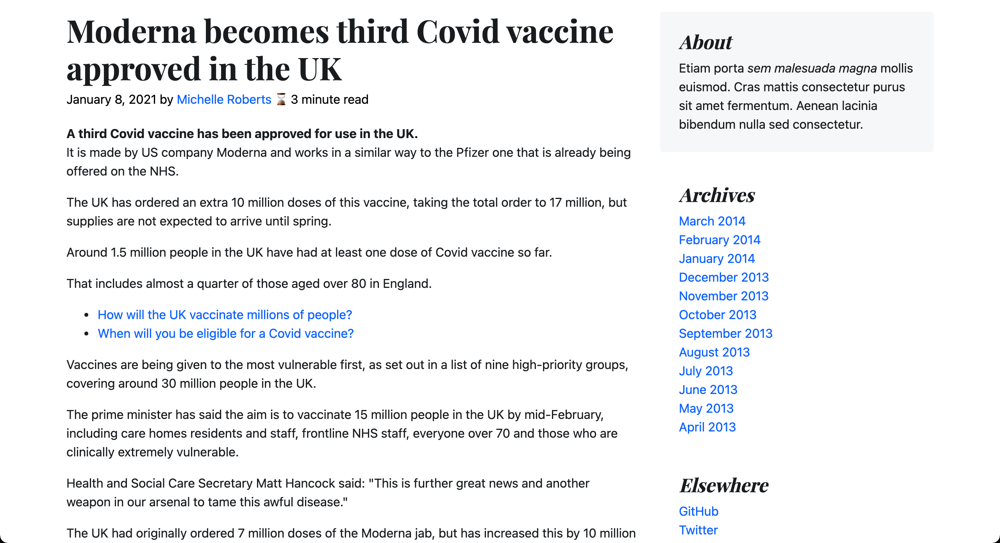

# Estimated Reading Time
This javascript function calculates the estimated reading time of an article using JavaScript.

WPM in this function is set 180. You can learn more about WPM <a href="https://en.wikipedia.org/wiki/Words_per_minute" target="_blank">here</a>.

## Screenshot

